<html>
  <h1>Project 1</h1>
  
"The data is like a map—it assists to visualize exactly where you are, where you've been, and where you need to go."
    Decision-making in modern times without data is equivalent to venturing out without navigational guidance. Public washrooms maintained by the Water and Sewer department of the City of Vancouver must be kept properly functional with both repairs and cleaning necessary for public convenience. We built an AWS-based data solution for monitoring usage and maintenance requirements along with accessibility enhancements of such facilities.
    Through effective data management we can determine public toilet usage rates to decide appropriate maintenance levels that benefit residents inside the area and those passing through it. Effective data management assists local governments to take better decisions through improved resource allocations which results in an overall improved service quality.
    

  <h2> 1. DATA INJECTION.(S3 Bucket)</h2>
  
Data ingestion refers to the operational method of extracting valuable information from multiple information sources. Data is gathered through three primary sources: IoT sensors used to monitor possessions, reports filed by maintenance staff members and the Open Data Portal of Vancouver that contains washroom and sewer-related data. The collected data helps both decision-making processes and analytical activities.  
  

  
 
  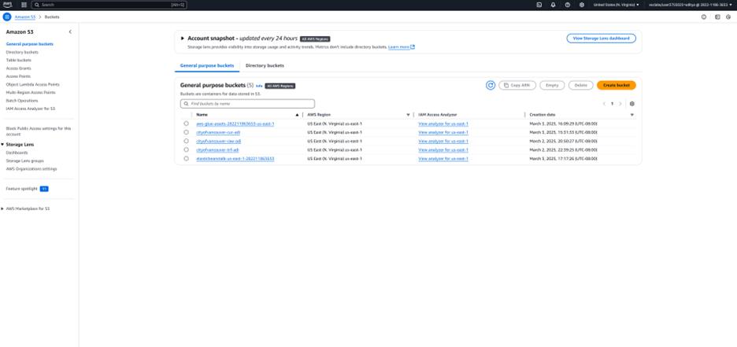
   
  
   
  <h2>DATA INJECTION</h2>
 
  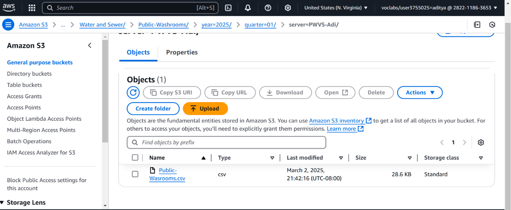
   
  <h2> DATA INJECTION</h2>
 
  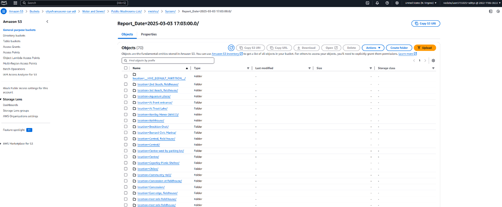
   
  <h2> DATA INJECTION</h2>
 
  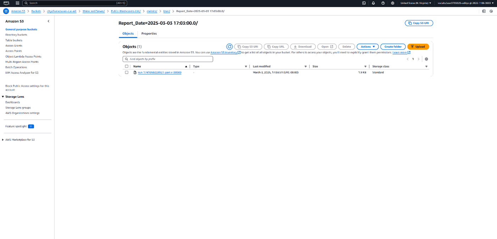
   
  <h2> DATA INJECTION</h2>
 
  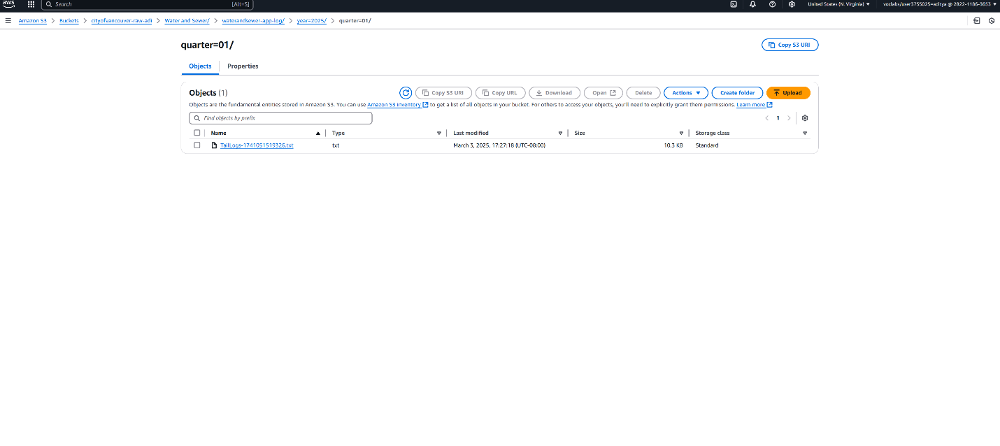
   
  <h2> DATA INJECTION</h2>
 
  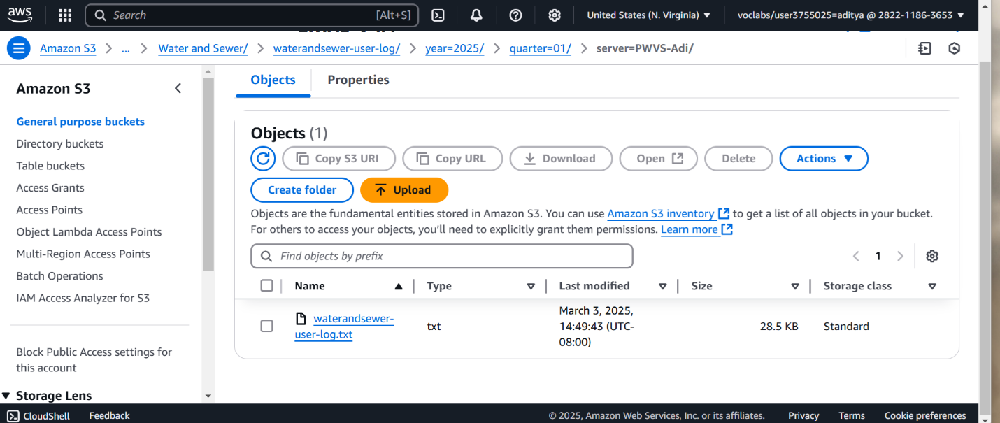
   
  <h2> DATA INJECTION</h2>
 
  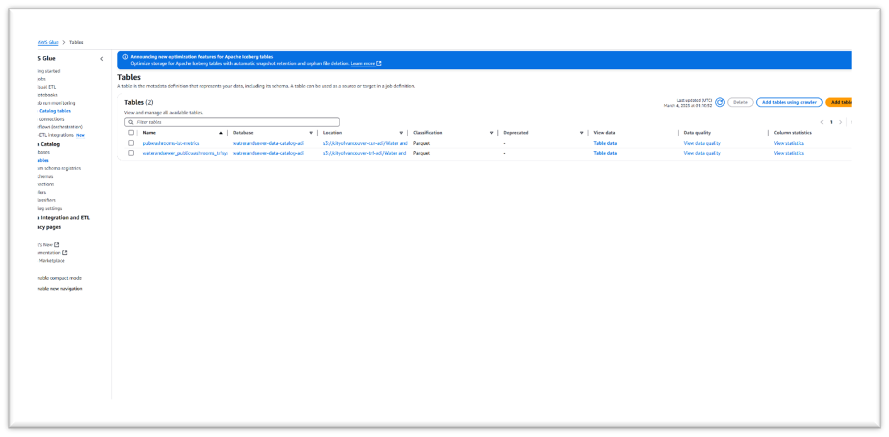
   
  <h2> DATA INJECTION</h2>
 
  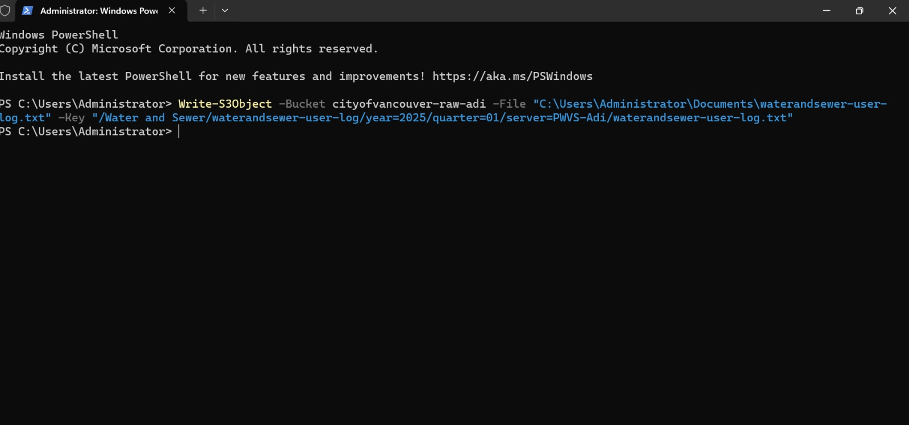
   
  <h2> DATA INJECTION</h2>
 
  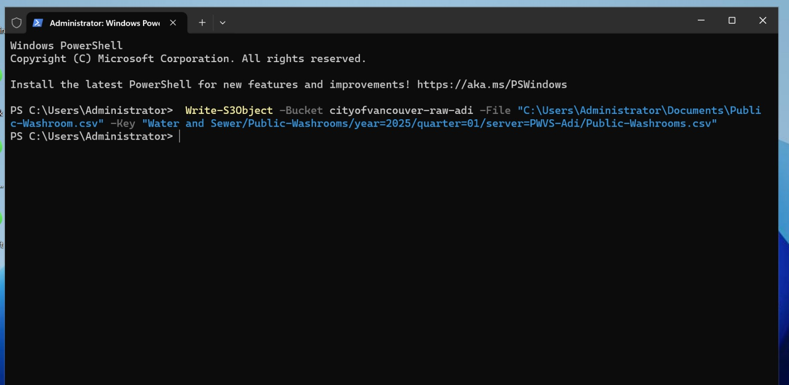
   
  <h1>2. DATA PROFILING</h1>
  
Data Profiling:
    Here, we will review the dataset so that we can achieve the following with AWS:
    Data structure: Column count, column name, column position and data type
     Content: The values in the column that include the lowest, highest, mean, average, etc.
     

 
  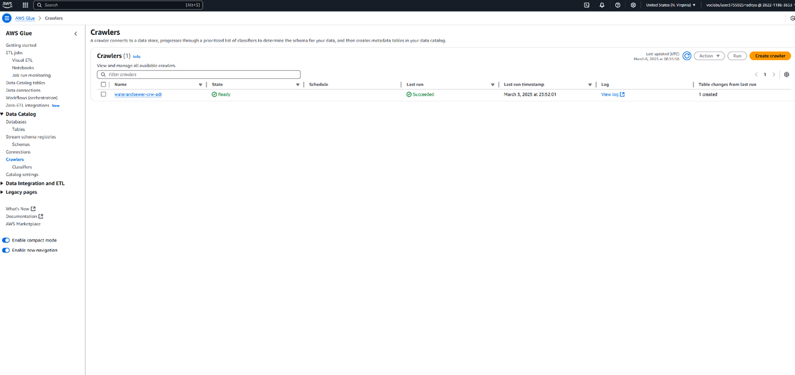
   
  <h2> DATA PROFILING</h2>
 
  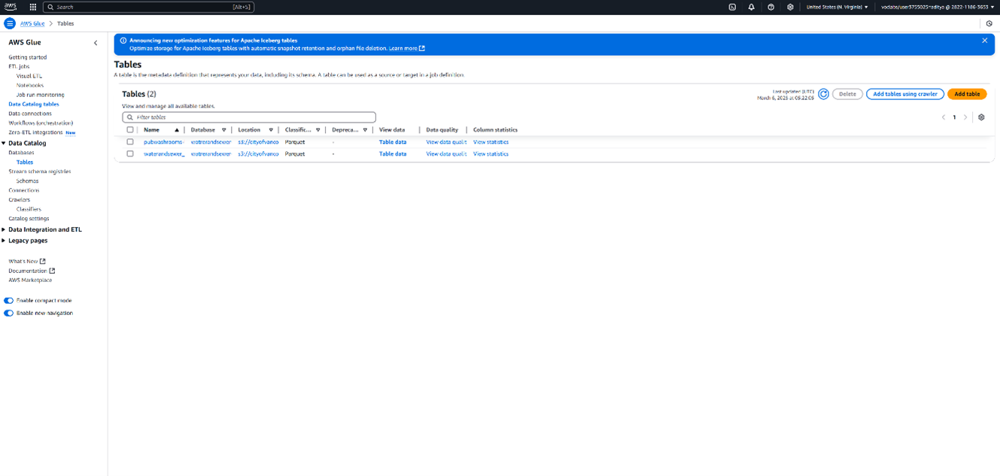
   
  <h2> DATA PROFILING</h2>
 
  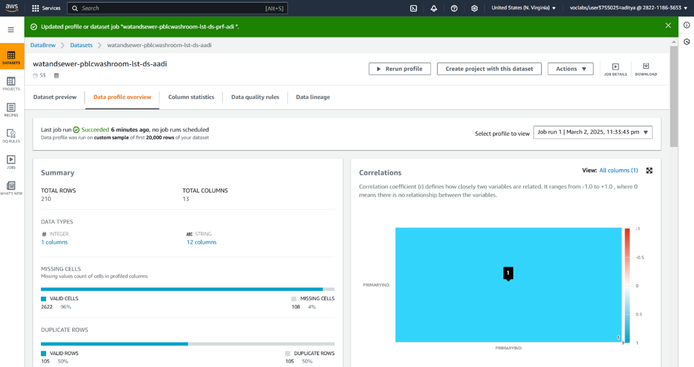
  <h2> DATA CLEANING</h2>
 
  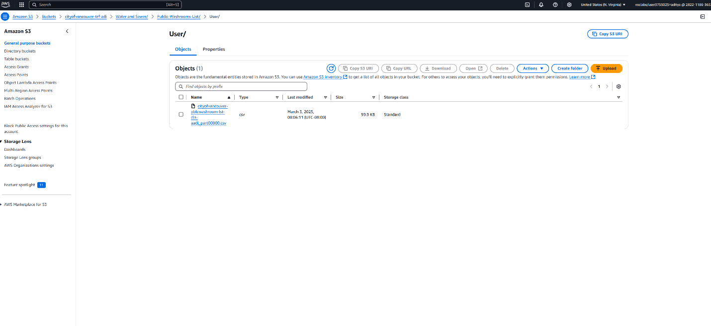
   
  <h2> DATA CLEANING</h2>
   
    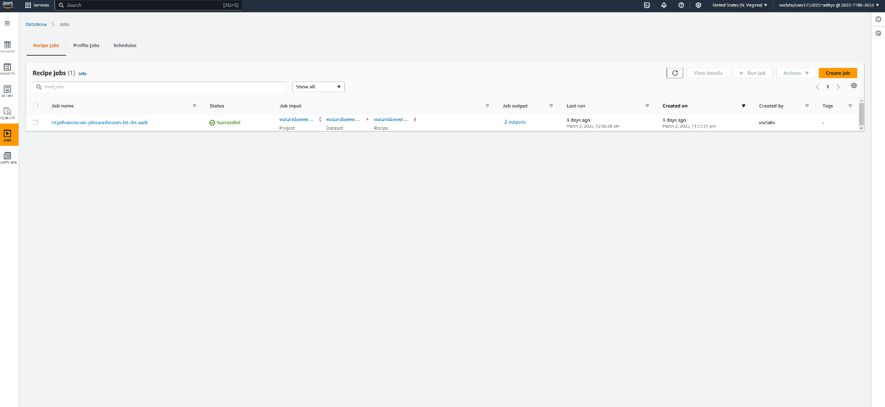
     
    <h2> DATA CLEANING</h2>
     
      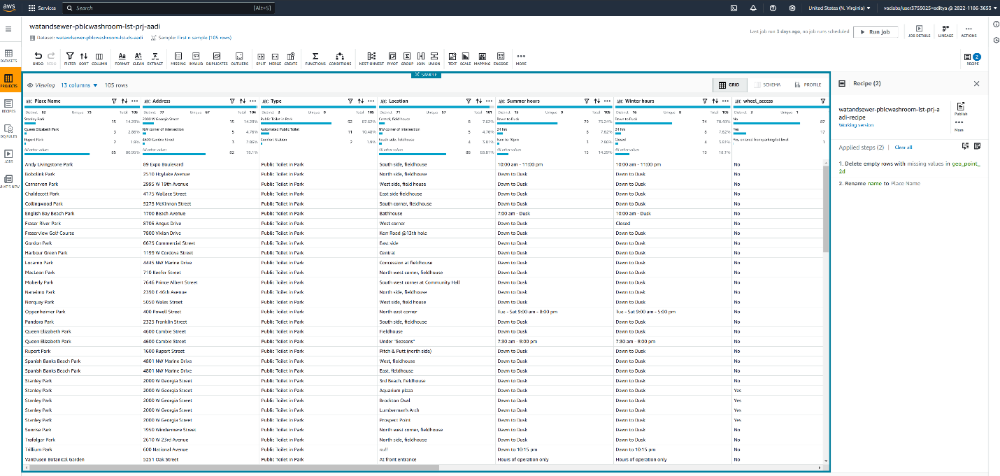
       
      <h2> DATA CLEANING</h2>
       
        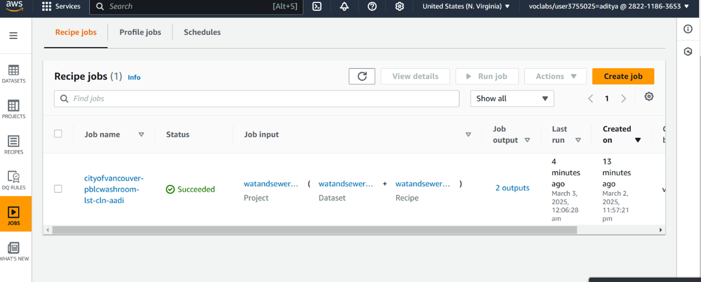
         
   
  <h1>4. DATA CATALOGING</h1>
  
Data-Cataloging
    AWS Glue Catalog serves as the tool to manage dataset catalogs.
    Establish metadata tables with attributes for washroom facilities and sewer hookup information and maintenance record tracking.
    The system requires rules which determine authorized access to vital information.
    Why is this done?
    Makes information readily searchable. AWS Glue Catalog facilitates analysts and urban workers to easily access important datasets.
    

    
   
    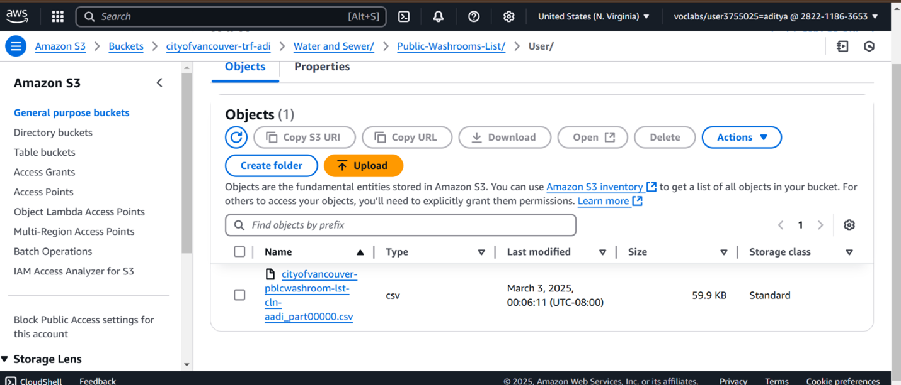
     
    <h2> DATA CATALOGING </h2>
 
  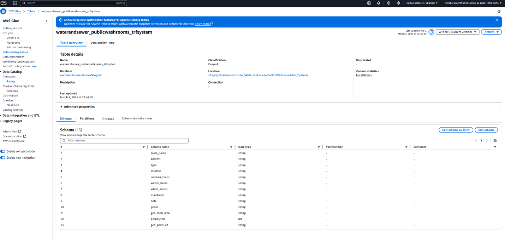
   
  <h2> DATA CATALOGING </h2>
   
  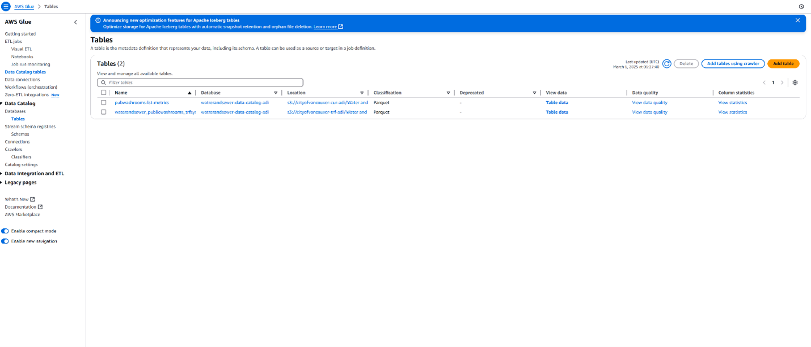
   
  <h2> DATA CATALOGING </h2>
   
  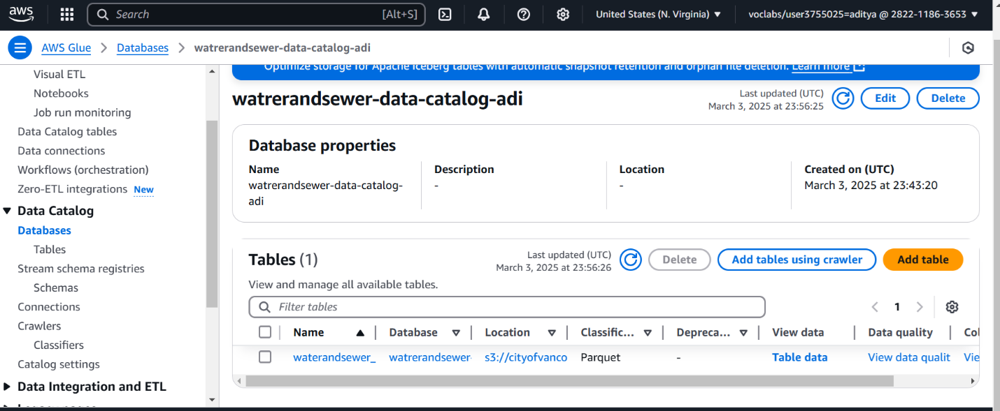
   
  <h2> DATA CATALOGING </h2>
   
  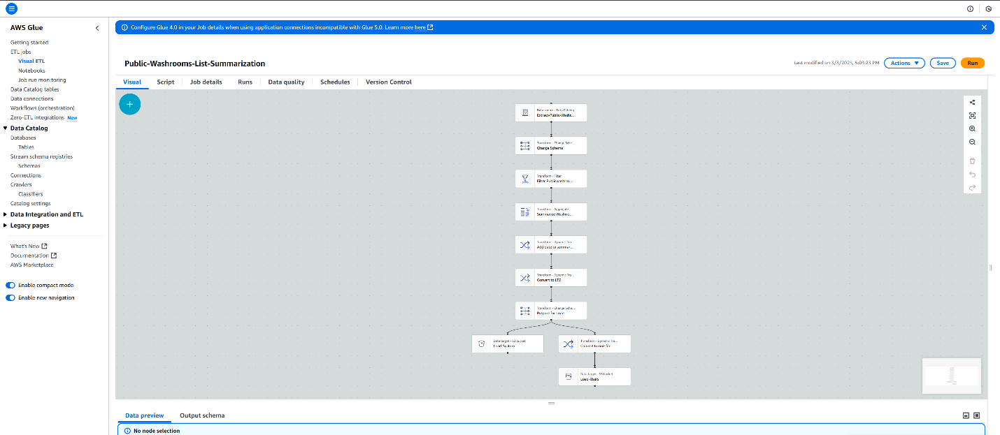
   
  <h1>4. DATA Sumarization</h1>
  
Data Sumarization:
   The information processed for report creation and insights generation falls under summarization. Implementation:
   The processed data should be stored and analyzed through AWS Redshift. Write important reports on:
    

    <li> The areas where sewer problems frequently occur.
      <li>High-maintenance washrooms needing upgrades.
      </li>
    
      </li>
       
      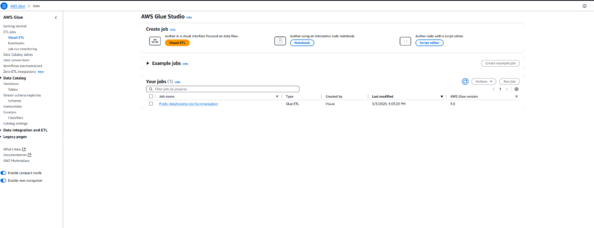
       
      <h1> INITIATE LIFECYCLE</h1>
      
Lifecycle Configuration helps manage expense effectiveness inside the AWS environment. The system automatically adjusts storage property types depending on how often users access their datasets through this feature. When files remain unused in ‘Glacier Instant Retrieval’ storage class for 90 days the system will move them to ‘Glacier Flexible Retrieval’ to lower the expense.

   
  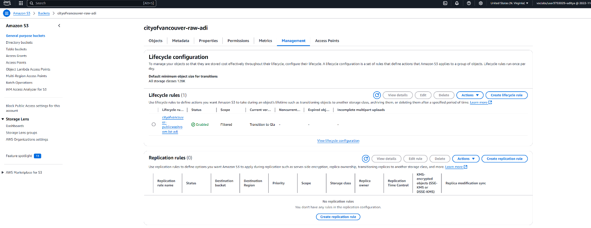
   
  <h1>5. DATA INJECTION (Powershell) </h1>
   
  
   
   
  <h2> DATA Injection (Powershell) </h2>
   
  
   
        

  <h1>Project 2</h1>
  
This research demonstrates the development of a Data Analytics Platform (DAP) to analyze washroom data collected by the City of Vancouver Water and Sewer Department. The main decision-making goal requires developing a systematic data management system to ensure data quality, data security, data governance and monitoring.
  

  <h1>1. Data Analysis</h1>
  
Implementation:
    The public washroom data stored in AWS S3 data lake could be accessed by using Amazon Athena for analytical purposes. Using an SQL command, I retrieved important data points while determining the average primary ID value in the dataset titled "pubwashrooms-lst-metrics". I then performed data sorting to locate the ten entries which displayed the highest average primary ID values.

 
  
   
  <h2> Data Analysis </h2>
   
  
   
  <h2> Data Analysis </h2>
   
  
   
   <h1>2. Data Security </h1>
  
Implementation:
    The S3 bucket data storage benefited from encryption through the implementation of AWS Key Management Service (AWS KMS) to ensure public washroom data safety. AWS KMS enables automatic encryption of stored data while it is saved to the S3 server. The bucket versioning capability of maintaining data history together with protection against accidental data removal.
    

   
   <h2> Data Security </h2>
   
  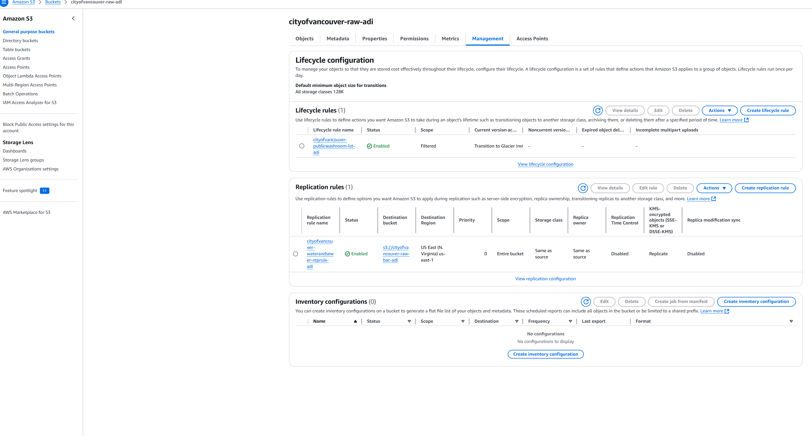
   
  <h2> Data Security </h2>
   
  
   
  <h2> Data Security </h2>
   
  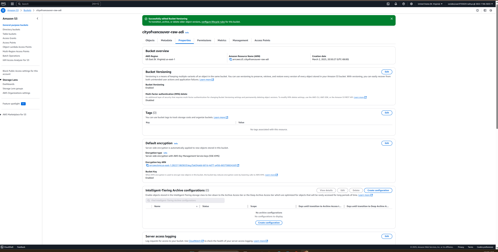
   
  <h1>3. Data Governance </h1>
    
Implementation:
      I used the public washroom dataset to create a structure in the AWS Glue Data Catalog. The dataset received a schema definition and metadata entry in the organization similar to establishing a catalog system of library resources. The data access rules I established through IAM policies determine which authorized users can read or amend the data.
      

     
    
     
    <h2> Data Governance </h2>
     
    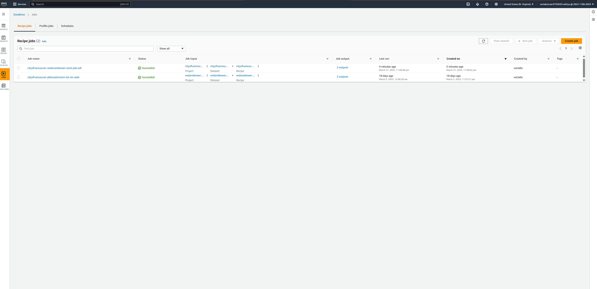
     
    <h2> Data Governance </h2>
     
    
     
    <h2> Data Governance </h2>
     
    
     
<h1>4. DATA MONITORING </h1>

Implementation:
The data monitoring role was established through AWS CloudWatch to supervise both the performance and data health of the system. CloudWatch acts as an observation system that provides information about BucketSizeBytes storage capacity and ResourceUsage resource allocation. CloudWatch creates separate S3 folders for data quality errors that occur with automatic logging to allow later analysis and data correction.

   
  
    
  <h2> DATA MONITORING </h2>
   
  
     
  <h2> Conclusion </h2>
  
My City of Vancouver Public Washrooms Data Platform implementation obeys standard practices for data analysis plus security processes and governance standards and monitoring systems.

  
</html>
